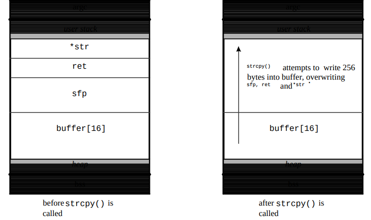

_[back to structure](structure.md)_

# Code injection

Low level languages directly compiled to machine code such as C/C++ offer wider
possibilites of implementation without the cost of speed. However this freedom
has a price, programs written in these languages make use of powerful
instructions that can easily backfire on the user if used improperly. Such
programs are known to be vulnerable to numerous attacks diverting the control
flow during the execution of the program. 

This paper will focus on one category of these attacks known as buffer
overflows. It is probably one of the most famous software vulnerability but
these attacks are still pretty common nowadays. A buffer overflow attack is an
anomaly where a program, while writing data to a buffer, overruns the buffer's
boundary and overwrites adjacent memory locations. In other words, a buffer
overflow condition exists when a program attempts to put more data in a buffer
than it can hold or when a program attempts to put data in a memory area past a
buffer.

Overflows can be used to modify return address or code pointers in order to
execute a malicious piece of code, sometimes already exisiting within the
program's space or injected by the attacker. They can be regrouped in two types:
stack-based overflows and heap-based overflows. Before going any further it is
required to understand how aprocess is organized in memory.


## Process Memory Organization

__Reference__ :

+ http://insecure.org/stf/smashstack.html

First off we will briefly describe the organization of processes in memory and
recap what is the stack. Processes are divided into three regions or segments:
Text, Data and Stack.


+ The **text segment** also known as code segment is fixed by the program, it
  includes the executable instructions - functions that make up the program
  (such as `main()` if the program is written in C/C++) - and read-only data.
  This region corresponds to the text section of the executable file. This
  region is normally marked read-only and any attempt to write to it will result
  in a segmentation violation.

+ The **data segment** is split in two parts: the initializated data part,
  simply called data segment and the uninitialized data part also known asthe
  BSS segment. The data segment contains the global variables and static
  variables which have a pre-defined value and can be modified. The BSS segment
  contains all global variables and static variables that are initialized to
  zero or do not have explicit initialization in source code.

Example written in C: 
```C 
static int bss_variable; // this static variable is stored in the BSS segment
int data_variable = 42;  // whereas this global variable is in the DATA segment
```

+ Then we have the **heap segment**. It is the region where dynamic memory
  allocation takes place. The heap area commonly begins at the end of the .bss
  and .data segments and grows to larger addresses from there.

+ The final segment is called **the stack**. A stack is a contiguous block of
  memory containing data. It is a LIFO (Last In First Out) data structure
  commonly used in computer science. A register called the stack pointer (we
  will call it SP) points to the top of the stack. In addition to the stack
  pointer, which points to the top of the stack, a frame or local base pointer
  (FP or LP) is also present which points to a fixed location within a frame.
  Its size is dynamically adjusted by the kernel at run time. The CPU
  implements instructions to PUSH onto and POP off of the stack. The stack
  consists of logical stack frames that are pushed when calling a function and
  popped when returning.  A stack frame contains the parameters to a function,
  its local variables, and the data necessary to recover the previous stack
  frame, including the value of the instruction pointer at the time of the
  function call. Depending on its implementation the stack will grow up or
  down. In the rest of this paper we will consider that the stack grows
  downwards to reproduce the behavior of Intel processors.

## Stack-based overflows

__Reference:__ 
+ https://web.eecs.umich.edu/~aprakash/security/handouts/Stack_Smashing_Vulnerabilities_in_the_UNIX_Operating_System.pdf
+ https://en.wikipedia.org/wiki/Morris_worm
+ https://en.wikipedia.org/wiki/Buffer_overflow
+ https://www.owasp.org/index.php/Buffer_Overflow
  

Back in November 1988, one of the first internet worm was born. Morris aka. the Internet Worm was written and launched from the Massachussets Institute of Technology by Robert Tappen, a graduate student at Cornell University. Despite damaging the Internet for hundreds of thousands of dollars, it also permitted a better understanding of a new variety of attacks called _buffer overflows_ or _stack smashing attacks_ which until then had been mostly theoretical. They were understood and partially publicly documented as early as 1972, however, Morris was the first publicly documented exploit using this attack vector.

The exploit relies on two factors: 
+ Low level language's liberal approach to memory handling (mostly C back in that time)
+ Unix filesystem permissions (other OSes were also vulnerable)

With cautious manipulations, an attacker could grant himself unrestricted priviledge to unpriviledged account or user. To explain the functionning of this attack we will begin by an example of a typical stack behavior.

When invoking or exiting a standard C function, the procedure prolog or epilog
must be called, this involves saving the previous variables and allocating
space for the new variables; and vice-versa when the function exits. The
previous FP is pushed, a new FP is created and SP operates with respect to its
new local variables. 

Using the below code as an example depicts a straightforward situation:

```C
void function(int a, int b, int c) {
  char buffer1[10];
  char buffer2[20];
}

void main() {
  function(1, 2, 3);
}
```
The x86 assembly language equivalent of the `function()` call in the above code is translated to:

```asm
 pushl $3 ; push function() argument 3
 pushl $2 ; push function() argument 2
 pushl $1 ; push function() argument 1
 call function ; call function() and push IP onto the stack
```
_As a side note, we can observe that the arguments of `function()` are pushed in reverse order on the stack. In fact, at assembly level, it doesn't matter if the parameters are passed on the stack in written or reverse order. However, The inherent nature of a stack means that the stack pointer always points to the last thing pushed, which needs to be the first or leftmost argument in order to easily support variadic functions as implemented in C._

This pushes the 3 arguments to function backwards into the stack, and calls `function()`.
The instruction call will push the instruction pointer (IP) onto the stack. The first thing done in function is the procedure prolog:

```asm
pushl %ebp     ; push frame pointer onto stack
movl %esp,%ebp ; copy SP onto EBP, creating the new frame pointer (FP)
subl $20,%esp  ; allocate space for local variables
```
First, the frame pointer, EBP, is pushed onto the stack. The current SP is then
copied into EBP, making it the new FP pointer. Finally, the prolog proceeds to
allocate space for the local variables by subtracting their size from SP.
Memory addressing must work with multiples of words, this is why 20 is
subtracted from SP in this example.

Below is a simple buffer overflow example using string arrays:

```C
void function(char* str) {
  char buffer[16];
  strcpy(buffer, str);
}

void main() {
  char large_string[256];
  for (int i=0 ; i<255 ; i++)
    large_string[i] = 'A';
  function(large_string);
}
```

When compiled and executed the above code returns a segmentation violation. This happens because `function()` attempts to copy the content of `large_string` into `buffer` without bounds. `strcpy()` will simply write until the `\0` in `large_string` is found, overwriting SFP (old content of %EBP), RET (return address) and `function`'s only parameter `*str`.



By writing a string of A’s (0x41 in hex) into and over the stack, the return
address has changed to an address outside of the process address space. The
running process can no longer fetch the next instruction from the proper
address, overwritten with an address outside its process space, returning a
segmentation fault.

Controlling the return address is crucial for a successful stack-smashing attack 
and is the principal means by which all buffer overflows are exploited.

## Heap-based overflows


To address these problems, multiple defense mechanisms have been invented such
as Data Execution Prevention which we'll talk about in a next point


