<!-- $size: 16:9 -->


# Exploiting ROP attacks with a unique instruction


#### Julien Couvy, _Vrije Universiteit_

---

<!-- page_number: true -->


# Introduction

:arrow_right: Background information
:arrow_right: Our project with examples
:arrow_right: Limitations
:arrow_right: Results & Conclusion

---

# Return-into-libc and DEP

---

# Data Execution Prevention (aka. W^X)

:arrow_right: Industry response against __code injection__ exploits

:arrow_right: Marks all writable locations in a process's address space as __non executable__

:arrow_right: Hardware support in Intel and AMD processors

:arrow_right: Protection available in all modern OS

---

# Return-into-libc

:arrow_right: Evolution of code injection exploits

:arrow_right: No injection necessary,  __instead__ re-use functions present in shared libraries (libc common target)

:arrow_right: Sensible instructions like `system()` or `printf()`

:arrow_right: Removed from _glibc_, replaced by safe versions like `execve()`

---

# Return oriented programming

---

# Return oriented programming: Overview

:arrow_right: _The Geometry of Innocent Flesh on the Bone: Return-into-libc without Function Calls (on the x86)_, H.Shacham 2007

:arrow_right: Turing-complete exploit language

:arrow_right: Defeats DEP, code signing, and ASLR (non trivial)

:arrow_right: No function call required

---

# Return oriented programming: Machine level

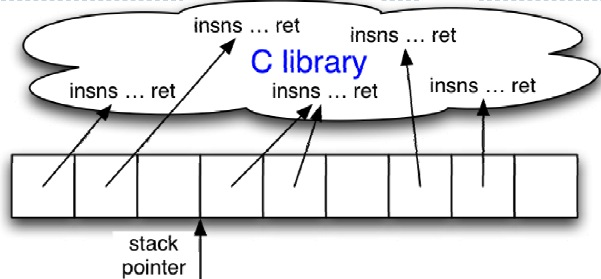

:arrow_right: The _stack pointer_ (%esp) determines which instruction sequence to fetch & execute

:arrow_right: Processor doesn't automatically increment %esp; - but the "ret" at the end of each instruction sequence does


---

# Return oriented programming: Gadgets

:arrow_right: Small instruction sequences ending in `ret`

:arrow_right: Already present in the target binary

:arrow_right: Chain of gadgets = attacker payload

---

# Problem

### Cratfting payload is complex and time-consumming...

### Can we automate it ?

---

# Our idea: _Mov2Rop_

---

# Mov2Rop: Objectives

:arrow_right: Prove that _return oriented programming_ can be made  more accessible ==> more dangerous

:arrow_right: Automatic gadget extraction and chaining...

:arrow_right: Simplified by targetting `mov` instructions only

---

# Mov2Rop: Tools used

:arrow_right: Language: __Python 3__

:arrow_right: Gadget extraction: __Ropper__

:arrow_right: Disassembly: __Capstone__

:arrow_right: Payload translation: __Movfuscator__

---

# Mov2Rop: Outline
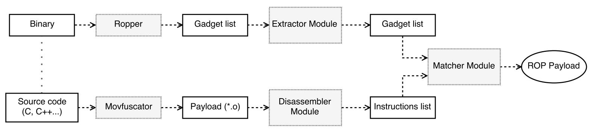

---

# Mov2Rop: Disassembler Module

:arrow_right: Uses Capstone framework

:arrow_right: Seaches for `mov` instructions in an object file 

:arrow_right: `mov` instructions are stored in custom __Instruction__ data structures

---

# Mov2Rop : Instruction example

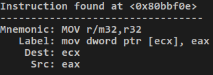

---
# Mov2Rop: Extractor Module

:arrow_right: Ropper's engine in a Python script

:arrow_right: Gadgets are identified with _regular expressions_...
`ropper -f fibonacci --type rop --search "mov e??, e??"`

:arrow_right: and stored in custom __Gadget__ data structures

---

# Mov2Rop: Gadget example

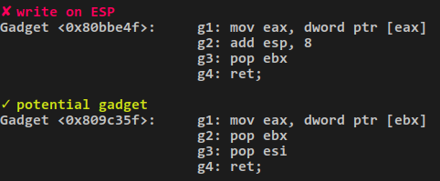

---

# Mov2Rop: Matcher Module

:arrow_right: Instruction analysis
- Instructions need to pass a set of rules to be validated

:arrow_right: Gadget chaining
- Tries to map a gadget chain with a payload instruction
- Searches for eventual side-effects

:arrow_right: Stack preparation and visualization
- Stores gadget addresses on the stack
- Searches for `pop` instructions
	 I. Safekeeping return addresses integrity
     II. Storing immediate values on the stack

---

# Mov2Rop: Chain example

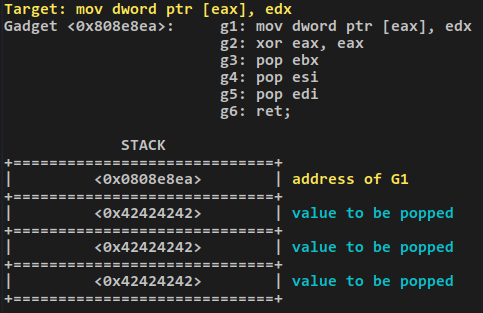

---

# Limitations

:arrow_right: Support only x86 32 bits and instructions using 32 bits registers

:arrow_right: Incomplete side-effect management

:arrow_right: External tools are flawed and limited

---

# Results

|Result 1| Result 2|
|:-:|:-:|
|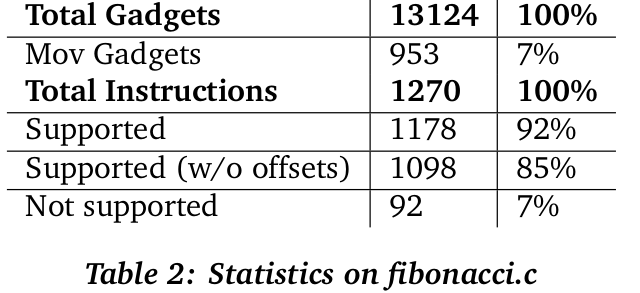|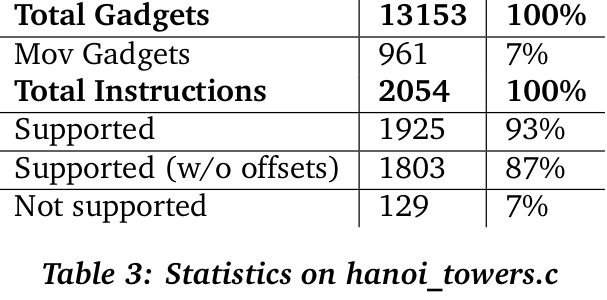|

---

# Further work

### Two possibilites:
#### :arrow_right: Improving current protoype
  - Cover all `mov` instructions
  - In depth side-effect verification
  - x86_64 support
  - ...

#### :arrow_right: Integration as backend in LLVM
  - _Pro:_ LLVM = growing project with strong community, LLVM IR allows to use any input language easily
  - _Con:_ Dropping the idea of `mov` only instructions (original motivation)

---

|Object dump|Gadgets found|
|:---:|:---:|
| 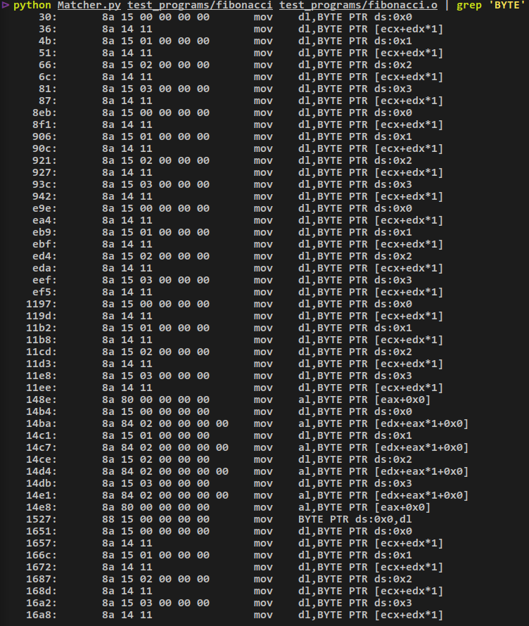|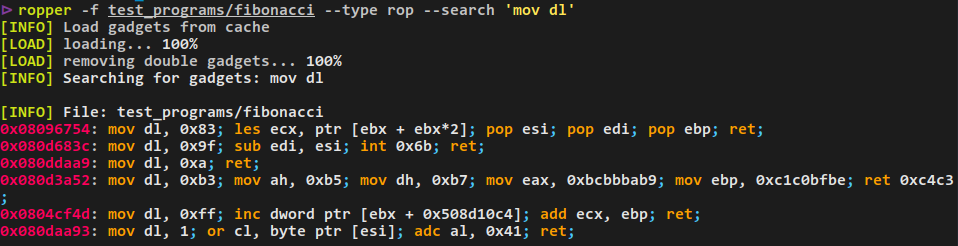 |
 
---

| Finding gadgets | Payload instructions |
|:---:|:---:|
|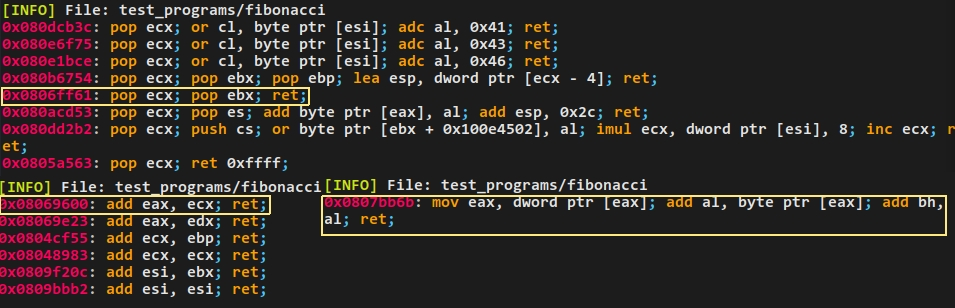|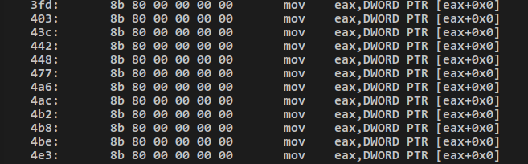|
 
```html
             STACK
+=============================+
|         <0x0806ff61>        | address of G1 <pop ecx; pop ebx; ret;> 
+=============================+
|         <0x00000000>        | value required in %ecx
+=============================+
|         <0x42424242>        | dummy value for <pop ebx;>
+=============================+
|         <0x08069600>        | address of G2 <add eax, ecx; ret;>
+=============================+
|         <0x0807bb6b>        | address of G3 <mov eax, dword ptr [eax]...> 
+=============================+
              ...
```

---

# Thank you for your attention. 
# Any questions ?